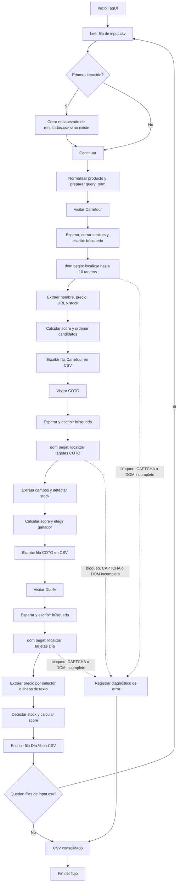

# Análisis del flujo de automatización de `supermercados.tag`

## 1. Resumen ejecutivo

`supermercados.tag` es un flujo TagUI secuencial que recibe productos desde `input.csv`, visita Carrefour, COTO y Día %, extrae el primer candidato relevante de cada sitio y agrega una fila por supermercado en `resultados.csv`.

El script combina tres mecanismos:

- **Acciones TagUI visibles:** navegación, espera, detección de elementos, escritura y pulsación de Enter.
- **Bloques `dom begin` / `dom finish`:** JavaScript ejecutado dentro del contexto DOM de la página para localizar tarjetas, leer nombre, precio, stock y URL.
- **Instrucciones `js`:** JavaScript ejecutado por el flujo TagUI para preparar variables, parsear el resultado DOM y escribir datos estructurados.

La arquitectura está duplicada por supermercado: cada bloque repite normalización, búsqueda de tarjetas, extracción de campos, cálculo de score y selección del candidato. Esa repetición es el principal punto de aplicación del principio DRY.

## 2. Flujo de ejecución

### 2.1 Inicialización por iteración

Para cada fila de entrada, TagUI expone variables como `iteration`, `producto`, `cantidad` y `unidad`.

En la primera iteración, el script crea el encabezado de `resultados.csv` si el archivo no existe. El esquema generado tiene diez columnas:

```text
modo,producto_solicitado,nombre_encontrado,precio,supermercado,url,fecha,stock_status,cantidad,unidad
```

Después:

1. Calcula la fecha actual.
2. Determina el modo de ejecución, la cantidad y la unidad.
3. Limpia comillas del producto.
4. Construye `query_term`, agregando cantidad y unidad cuando no aparecen en el texto original.
5. Calcula `prod_url`, aunque esa variable no se utiliza posteriormente para navegar.

### 2.2 Procesamiento de Carrefour

1. Abre `https://www.carrefour.com.ar`.
2. Espera tres segundos.
3. Busca y cierra el botón `Aceptar todo` si está visible.
4. Escribe `query_term` en `input.vtex-styleguide-9-x-input` y pulsa Enter.
5. Espera cuatro segundos para que aparezcan los resultados.
6. Declara valores por defecto: `No encontrado`, `N/D` y `NO ENCONTRADO`.
7. Ejecuta un bloque DOM que inspecciona hasta diez tarjetas.
8. Selecciona el candidato de mayor puntuación.
9. Escribe una fila para Carrefour en `resultados.csv`.

### 2.3 Procesamiento de COTO

El flujo repite el mismo patrón, con estas diferencias:

- URL: `https://www.coto.com.ar`.
- Campo de búsqueda: `input#cio-autocomplete-0-input`.
- Colección de resultados: `constructor-result-item, .product-card, article`.
- Nombre: `.nombre-producto, h3, h2`.
- Precio: `.card-title, h4, [class*="price"]`.

Luego escribe una fila con supermercado `COTO`.

### 2.4 Procesamiento de Día %

El flujo vuelve a repetir la misma estrategia:

- URL: `https://diaonline.supermercadosdia.com.ar`.
- Campo de búsqueda: `input#downshift-0-input`.
- Tarjetas: `article, [class*="product-summary"]`.
- Nombre: `h3, [class*="productBrand"]`.
- Precio: `[class*="sellingPrice"], [class*="currencyContainer"]`.

Si no encuentra un nodo específico para el precio, recorre las líneas de texto de la tarjeta y toma la primera que contiene `$`. Finalmente agrega una fila con supermercado `Día %`.

## 3. Lógica de inyección y extracción DOM

Cada bloque `dom begin` se ejecuta en el contexto de la página actualmente abierta. El código no llama directamente a las APIs internas de los supermercados: consulta el DOM renderizado por el navegador.

El resultado del bloque es una cadena JSON creada mediante `JSON.stringify(candidates[0])`. Fuera del bloque DOM, TagUI conserva ese valor en `dom_result`, que después se convierte en objeto:

```javascript
js var cData = null; try { cData = JSON.parse(dom_result); } catch(e){}
```

El flujo sigue esta secuencia:

1. Buscar tarjetas visibles o presentes en el DOM.
2. Limitar el conjunto a las primeras diez.
3. Localizar nombre, precio y enlace dentro de cada tarjeta.
4. Leer el texto de la tarjeta.
5. Inferir disponibilidad.
6. Normalizar nombre y consulta.
7. Calcular una puntuación.
8. Ordenar candidatos de mayor a menor puntuación.
9. Serializar el primero.
10. Copiar sus valores a las variables de salida.
11. Persistir el resultado con `csv_row(...)`.

## 4. Algoritmo de scoring

### 4.1 Normalización

`cleanText(s)`:

- Convierte el texto a minúsculas.
- Usa `normalize('NFD')` para separar letras y diacríticos.
- Elimina las marcas diacríticas.
- Sustituye signos de puntuación por espacios.
- Compacta espacios repetidos.
- Elimina espacios al principio y al final.

La consulta se convierte en `qStr` y se divide en palabras de al menos dos caracteres (`qWords`).

### 4.2 Puntuación positiva

Para cada candidato:

| Regla                                               | Puntaje |
| --------------------------------------------------- | ------: |
| El nombre normalizado contiene la consulta completa |    +100 |
| Cada palabra de la consulta aparece en el nombre    |     +20 |

La condición de coincidencia completa usa `indexOf`, por lo que es una coincidencia por subcadena, no una comparación de tokens o de límites de palabra.

Ejemplo conceptual:

```text
Consulta: "manaos cola"
Nombre:   "gaseosa cola manaos 2,25 lts"
```

El candidato recibe la bonificación completa si la cadena normalizada de la consulta aparece dentro del nombre. Si el orden de las palabras cambia, puede perder los +100 aunque conserve puntos parciales.

### 4.3 Penalización de falsos positivos

El script aplica una regla específica para consultas de bebidas:

```text
Si la consulta contiene "gaseosa" o "bebida"
y el candidato contiene "shampoo", "jabon" o "xkg"
entonces score -= 200
```

Esta regla intenta descartar productos claramente incompatibles, pero es limitada porque:

- Sólo contempla tres términos incompatibles.
- No usa el motor central de validación semántica de `validador.js`.
- `xkg` funciona como una heurística textual, no como una validación dimensional.
- No penaliza otros cruces, por ejemplo arroz frente a fideos o leche frente a bebida vegetal.

### 4.4 Evaluación de stock

El producto se marca como `SIN STOCK` si se cumple alguna de estas condiciones:

- La tarjeta contiene un selector de indisponibilidad:
  - Carrefour: `[class*="unavailable"]` o `[class*="outOfStock"]`.
- El texto contiene `agotado`, `sin stock` o `no disponible`, según el supermercado.
- No se encuentra un precio.
- El precio es vacío, `N/D`, `$ 0` o `$ 0,00`.

Si no se cumple ninguna condición, el producto se marca como `DISPONIBLE`.

El stock también afecta el score:

```text
Producto no disponible => score -= 10
```

La penalización es pequeña frente a la bonificación de coincidencia completa de +100. Por eso un producto sin stock pero con buen nombre puede quedar primero si no existe otro candidato mejor.

### 4.5 Selección final

El script ordena los candidatos así:

```javascript
candidates.sort(function (a, b) {
  return b.score - a.score;
});
return JSON.stringify(candidates[0]);
```

No hay un umbral mínimo de aceptación. Siempre que exista al menos una tarjeta con nombre, se devuelve el primer candidato, incluso si su score es cero o negativo.

Además, el score usa `producto` y no `query_term`. Esto significa que la cantidad y la unidad agregadas a `query_term` no participan necesariamente en la evaluación del nombre extraído.

## 5. Consolidación en CSV

Cada supermercado escribe una fila con el mismo contrato de diez columnas:

```text
modo,
producto solicitado,
nombre encontrado,
precio,
supermercado,
url,
fecha,
estado de stock,
cantidad,
unidad
```

Por cada producto de entrada se esperan hasta tres filas: una de Carrefour, una de COTO y una de Día %. Si no hay resultados, el script conserva los valores por defecto y escribe igualmente la fila.

## 6. Puntos de falla críticos

### 6.1 Selectores CSS frágiles

Los selectores dependen de clases internas y nombres generados por las plataformas:

- `input.vtex-styleguide-9-x-input`
- `input#cio-autocomplete-0-input`
- `input#downshift-0-input`
- `[class*="productBrand"]`
- `[class*="sellingPrice"]`
- `[class*="currencyContainer"]`

Estos selectores pueden romperse por:

- Cambios de versión del frontend.
- Migraciones de VTEX, Angular o React.
- Renderizado diferido.
- Variantes regionales o experimentos A/B.
- Diferencias entre escritorio y móvil.

Los selectores parciales aumentan la tolerancia a cambios de nombres, pero también pueden devolver nodos equivocados. Por ejemplo, `[class*="price"]` puede coincidir con un precio unitario, un precio anterior o un precio promocional.

### 6.2 Dependencia de la posición de los elementos

El script sólo inspecciona las primeras diez tarjetas. Si la primera página incluye banners, productos patrocinados o recomendaciones, el producto correcto puede quedar fuera del conjunto analizado.

También se selecciona la primera línea que contiene `$` en Día %. Esa línea podría corresponder a precio anterior, precio por unidad o texto promocional.

### 6.3 Esperas estáticas

El flujo utiliza `wait 3`, `wait 4`, `wait 2` y otras esperas fijas. Esto tiene dos efectos:

- **Rendimiento:** en redes rápidas se desperdicia tiempo esperando aunque la página ya esté lista.
- **Fiabilidad:** en redes lentas, el tiempo puede ser insuficiente y el extractor observa un DOM incompleto.

La duración real depende de latencia, carga de scripts, cookies, geolocalización, CPU y disponibilidad del sitio.

### 6.4 Bloqueos antibot y estados inesperados

No existe una detección explícita de:

- CAPTCHA.
- Página de bloqueo o rate limiting.
- HTTP 403/429.
- Pantalla de login.
- Modal obligatorio de código postal.
- Consentimiento de cookies con otro idioma o texto.
- Redirección a una página de error.
- Fallo de DNS o navegación incompleta.

En esos casos, el script puede interpretar una página de bloqueo como una página sin productos y escribir `NO ENCONTRADO`, ocultando la causa real.

### 6.5 Stock y precio

La detección de stock basada en texto es vulnerable a cambios de idioma, mayúsculas, iconos y mensajes equivalentes. El precio puede ser incorrecto si la tarjeta contiene varios precios o si el selector apunta al precio tachado.

La comprobación de precio cero cubre sólo unas pocas representaciones. No contempla, por ejemplo, separadores de miles alternativos, espacios no separables o precios expresados en atributos HTML.

### 6.6 Contrato de CSV

El script asume que:

- `input.csv` tiene las columnas esperadas.
- Las comas y comillas de los productos no requieren un parser más completo.
- `csv_row` escapará correctamente nombres y URLs.
- El encabezado existente coincide con el esquema requerido.

Si el archivo ya existe con un encabezado incorrecto, la condición inicial no lo corrige.

## 7. Recomendaciones de refactorización DRY

### 7.1 Centralizar la extracción

La lógica repetida debería convertirse en una función parametrizable:

```javascript
function extraerProducto(config) {
  const cards = Array.from(
    document.querySelectorAll(config.cardSelector),
  ).slice(0, config.maxCards);
  const candidatos = [];

  for (const card of cards) {
    const nombre = card.querySelector(config.nameSelector);
    const precio = obtenerPrecio(card, config);
    const enlace = card.querySelector(config.linkSelector);
    if (!nombre) continue;

    const stock = detectarStock(card, precio, config.stockTerms);
    const score = puntuarProducto(config.query, nombre.innerText, stock);
    candidatos.push({
      name: nombre.innerText.trim(),
      price: precio,
      url: enlace ? enlace.href : window.location.href,
      stock,
      score,
    });
  }

  return seleccionarCandidato(candidatos, config.minimumScore);
}
```

Cada supermercado aportaría solamente una configuración:

```javascript
{
    cardSelector: 'article, [class*="product-summary"]',
    nameSelector: 'h3, [class*="productBrand"]',
    priceSelector: '[class*="sellingPrice"], [class*="currencyContainer"]',
    linkSelector: 'a[href*="/p"], a',
    stockTerms: ['agotado', 'sin stock', 'no disponible']
}
```

### 7.2 Compartir el motor semántico

La normalización y las reglas de incompatibilidad deberían vivir en una única función compartida con `validador.js`. El extractor TagUI no debería mantener una segunda lista parcial de falsos positivos.

Una alternativa conservadora es exportar desde un módulo Node las funciones puras:

- `normalizarTexto`.
- `detectarIntencion`.
- `validarCoincidencia`.
- `normalizarPresentacion`.

El bloque DOM podría realizar sólo extracción primaria y devolver varios candidatos. La validación final se haría fuera del DOM con el mismo motor usado por el Dashboard y por el generador Excel.

### 7.3 Reemplazar esperas fijas por espera condicionada

Siempre que la versión de TagUI lo permita, conviene esperar por condiciones observables:

- Existencia del input de búsqueda.
- Aparición de una tarjeta.
- Desaparición del indicador de carga.
- Presencia de un mensaje de bloqueo.
- Cambio de URL después de una búsqueda.

Debe mantenerse un timeout máximo para evitar bloqueos indefinidos.

### 7.4 Devolver motivos de rechazo

El resultado DOM debería incluir un diagnóstico, no sólo `name`, `price` y `stock`:

```javascript
{
    status: 'REJECTED',
    reason: 'NO_MATCHING_CARD',
    pageState: 'BLOCKED_BY_CAPTCHA',
    candidatesSeen: 10
}
```

Esto permitiría diferenciar `NO ENCONTRADO` de un bloqueo del sitio.

### 7.5 Añadir umbral de aceptación

La selección debería exigir un score mínimo y, preferiblemente, una validación semántica posterior:

```javascript
const ganador =
  candidatos
    .filter((c) => c.stock !== "SIN STOCK")
    .filter((c) => c.score >= MINIMUM_SCORE)
    .sort((a, b) => b.score - a.score)[0] || null;
```

El valor del umbral debe probarse con casos reales y no definirse sólo de forma arbitraria.

## 8. Diagrama de flujo



## 9. Prioridad sugerida

1. Añadir detección explícita de CAPTCHA, bloqueo, HTTP 403/429 y páginas de error.
2. Introducir un umbral mínimo de score y rechazar candidatos débiles.
3. Compartir normalización, scoring y validación con `validador.js`.
4. Reemplazar esperas fijas por esperas condicionadas con timeout.
5. Centralizar selectores y reglas por supermercado en configuraciones.
6. Agregar pruebas de regresión con DOM simulados para producto correcto, producto sin stock, precio promocional, tarjeta patrocinada y página bloqueada.
